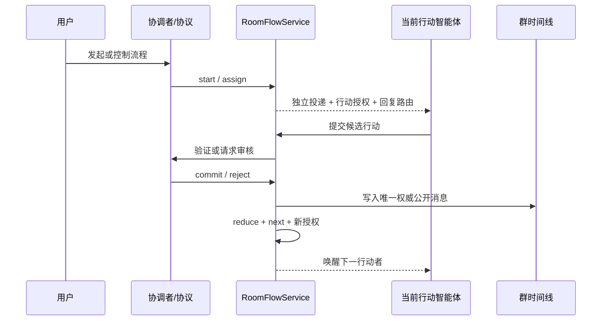

# 群流程、行动权与自动续接

> 状态：骨架已落地（对照 2026-09-15 源码）  
> 设计日期：2026-09-13  
> 适用范围：AgentBot 群聊、智能体协作、需要按顺序推进的多人流程  
> 验收测试：`test/room-flow.test.ts`（15 项）

下文 2 节起仍是设计依据。与代码不一致处以 **§1.1 当前实现对照** 为准。

## 1. 结论

当前问题不是斗地主提示词写得不够细，而是系统只有“群消息广播”，没有“群流程执行模型”。

普通群聊和有顺序的协作被当成同一种场景：一条用户消息到达后，多名成员各自启动独立回合，各自从自然语言推断当前状态、行动者和下一步。它们共享可见文本，却不共享受平台约束的状态机，因此会稳定地产生以下现象：

- 同一件事多人重复确认、重复宣布；
- 未轮到的成员抢答，轮到的成员却没有自动继续；
- 文本里写了“下一个是李四”，但系统并没有真正唤醒李四；
- 主持人在群回合中私信成员，成员醒来后已不在群回合，无法把结果发回原群；
- 各智能体各自记状态，出现牌数、行动顺序和合法性互相矛盾；
- 智能体能声称“已经发群里了”，实际没有任何已提交的群消息；
- 用户说“停”只停当前回合，已经派发的后续回合仍继续运行；
- 群消息被投影到私聊界面，看起来像同一批消息复制了两遍。

正确方向是在现有开放群聊之上增加一个可选的“受控群流程”层。平台负责行动权、状态版本、路由、推进、停止和恢复；模型只负责在获得权限后生成一个候选行动。

## 1.1 当前实现对照

### 已落地

| 能力 | 代码位置 | 行为 |
| --- | --- | --- |
| 房间模式 `open` / `managed` | `src/room/types.ts`、`RoomStore.setMode` | 新建房间默认 `open`；启动流程后切 `managed`；完成/取消/预算耗尽回到 `open` |
| 流程契约 | `src/shared/contracts/room-flow.ts` | `RoomFlow`、`RoomActionGrant`、`RoomActionProposal`、`RoomFlowEvent`、HMAC `replyRoute` |
| 持久化 | `src/storage/room-flow-store.ts` | 见下方存储布局；`flow` 级串行锁 + 原子 JSON；outbox 与状态同事务 |
| 状态机 | `src/server/runtime/room-flow-service.ts` | `startFlow` / `submitProposal` / `pauseFlow` / `resumeFlow` / `cancelFlow` / `recoverOutbox` |
| 确定性协议 | `src/server/runtime/room-flow-protocols.ts` | 内置 `sequential_turn`（别名 `sequential-turn`）：顺序轮转，默认最多 5 轮 |
| 路由 | `src/server/runtime/room-flow-router.ts` | `managed` 不扇出；用户停止词暂停；暂停后「继续」「恢复」恢复；`awaiting_user` 把用户发言当候选行动 |
| 自动接棒 | `src/server/runtime/room-flow-scheduler.ts` | `grant_ready` outbox → 收件箱投递（带 `replyRoute` + FLOW_BRIEF）→ `InboxScheduler` 唤醒 |
| 独立回合回群 | `src/tools/builtin/send-to-user.ts` | 无群回合但有有效 `replyRoute` 时，`to:"room"` 提交候选行动 |
| 控制工具 | `src/tools/builtin/manage-room-flow.ts` | `start` / `pause` / `resume` / `cancel` / `status`；控制动作仅协调者 |
| HTTP / UI | `src/server/routes/rooms.ts`、`web/src/components/ChatView.tsx` | `GET /flow`、`POST /flow/control`；群顶栏显示协议/阶段/状态/行动者，按钮暂停、继续、取消 |
| 停止作用域 | `StopCoordinator.stopRoomFlow` | `StopScope.kind = 'room_flow'`，撤销相关票据；与流程 pause 一起生效 |
| 崩溃恢复 | `AgentRuntime.recover` | 启动时 `recoverOutbox()`，未派发的时间线消息和 grant 会补发 |
| 私聊不投影群经验 | `presenters.privateConversationMessages` | 带 `roomId` 或 `source==='room'` 的消息不进私聊 UI |

### 当前协议：`sequential_turn`

参与者按 `actors` 顺序轮转。行动内容是 `{ text }`（可选 `type: "action" | "pass" | "finish"`）。轮到 `user` 时流程进入 `awaiting_user`，主人下一条群消息作为候选行动，且 `skipPublishTimeline` 避免同一条用户消息写两遍。默认 `maxRounds=5`，超出则 `completed`。没有斗地主或其它业务协议包。

### 控制面与设计稿的差异

设计稿里的 `assign` / `commit` / `reject` / `await_user` / `complete` **没有**做成 `ManageRoomFlow` 动作。确定性协议在 `submitProposal` 内完成校验、归约、签发下一授权。协调者只负责 `start` 和暂停/恢复/取消/查询。

授权默认 10 分钟过期。`clientActionId` 已接受则幂等返回，不重复提交。预算默认：50 次转换、100 次智能体运行、200 次工具、30 分钟墙钟、512KiB 状态、10MiB 事件；当前实现主要检查转换次数、墙钟和状态字节，触顶后结束流程并恢复 `open`。

`managed` 但找不到活动流程时，路由器会把房间改回 `open`，避免消息黑洞。

### 存储布局（已实现）

```text
.agentbot/room-flows/
  index.json          # activeByRoom、flows 元数据
  secret.key          # replyRoute HMAC，0600
  <flowId>/
    flow.json
    state.json
    grants.json
    events.jsonl
    proposals.jsonl
    outbox.jsonl
    dispatched.jsonl
```

### 尚未按设计稿落地

- LLM 协调协议（开放式评审的审核路径）；目前只有确定性 `sequential_turn`
- 可观测性计数器（`room_flow_*` 指标）和流程调试面板
- 流程内部事件的独立 UI；群顶栏只显示摘要
- `ManageRoomFlow` 的 assign/commit/reject 手工审核动作
- 成员被删除时自动 `paused` + `needs_attention`（设计 §14）未单独实现
- `all_agents` 停止作用域：`POST /api/control/stop-all` 明确返回不支持

### 怎么用（当前）

1. 在群里让某位成员调用 `ManageRoomFlow`：`action=start`，`protocol=sequential_turn`，`actors` 列出参与者（可含 `{kind:"user",id:"owner"}`）。
2. 平台把房间设为 `managed`，签发第一个行动授权，向该智能体收件箱投递 FLOW_BRIEF。
3. 行动者用 `SendToUser(to:"room", content:"...")` 提交；通过后公开并自动唤醒下一个。
4. 轮到主人时群顶栏显示「等待用户」，下一条群消息即行动。
5. 主人可点顶栏暂停/继续/取消，或在群里说「停」「继续」。

## 2. 目标与非目标

### 2.1 目标

1. 普通聊天仍然自然：问候、讨论和点名继续按现有群聊语义工作。
2. 有顺序的任务可以自动接棒，不需要主人每一步再说一句话。
3. 同一时刻只有获得行动权的参与者能提交会改变流程的行动。
4. 群内存在唯一权威状态，不能由多个模型各自宣布不同事实。
5. 群消息、私聊消息、内部经验和执行日志有明确边界，不相互冒充。
6. “已发送”“已提交”“已停止”等陈述必须有平台回执支持。
7. 流程可暂停、恢复、取消和崩溃恢复，迟到结果不能污染新状态。
8. 设计是通用基础设施，可以承载牌局、评审、多人排障和串行审批，而不是为某一段对话打补丁。

### 2.2 非目标

- 不在 `RoomDispatcher` 中硬编码斗地主或任何具体业务规则。
- 不让 `SendToAgent` 变成等待对方完成的同步派工接口。
- 不依赖提示词保证互斥、顺序、幂等或停止。
- 不通过解析“轮到李四”“请张三回复”等自然语言决定调度。
- 不把群内模型上下文直接展示成用户与该智能体的私聊消息。
- 不重新建立“发送者停止会递归停止收件人”的父子任务关系。

## 3. 现有故障的根因

### 3.1 可见、唤醒、必须发言和允许行动被混为一谈

这四个概念必须分开：

| 概念 | 含义 | 是否一定产生公开消息 |
| --- | --- | --- |
| 可见 | 成员能在上下文中看到消息 | 否 |
| 唤醒 | 为成员创建一次模型回合 | 否 |
| 必须发言 | 该回合应当给出群内回复 | 是 |
| 允许行动 | 该成员可改变受控流程状态 | 只有提交被接受后才是 |

当前群广播基本等价于“所有人可见并全部唤醒”。对普通讨论尚可，对牌局、审批和接力任务就会造成竞争。

### 3.2 文本交接不等于执行交接

“下家李四，请接牌”只是一段文本。除非同时创建了结构化的行动授权并把李四入队，否则它不会启动李四的新回合。

反过来，如果主持人用普通 `SendToAgent` 私信李四，李四得到的是一个独立私聊回合。该回合没有原群的受信路由，调用 `SendToUser(to:"room")` 会被正确拒绝。这里缺少的不是放宽权限，而是带签名的“回复原流程”能力。

### 3.3 多个模型同时充当事实源

参与者和主持人都能直接宣布“已发牌”“谁是地主”“当前轮到谁”。系统没有版本号、提交者和合法性检查，后到的文本可以和先前事实冲突。

### 3.4 群回合结束后没有自动续接

当前调度通常由新用户消息触发。成员发言落入时间线后，除显式 `@` 外，没有“结果已提交 → 计算下一行动者 → 唤醒下一行动者”的闭环。因此用户不得不反复说“出呀”“继续”。

### 3.5 停止边界不是流程边界

当前回合、收件箱投递、房间轮次和被唤醒成员是不同执行实体。只停止当前助手回合，不能证明同一业务流程的其他激活票据已经撤销。

### 3.6 展示投影和模型上下文混用

为了让智能体理解群聊，群消息可以写入其内部经验；但内部经验不是一条私聊。若 UI 直接把内部经验当作私聊消息展示，就会出现群和私聊内容完全一样、身份错位和重复消息。

## 4. 总体模型：一个房间，两种运行模式

### 4.1 开放模式 `open`

用于普通群聊，沿用《群聊点名.md》的语义：

- 房间成员都能看到群消息；
- `@` 决定被点名者必须回应；
- 未点名成员可依据相关性决定是否回应；
- 社交性群消息可以让所有成员自然回应；
- 用户的新消息可以触发一次开放群轮次。

开放模式没有“当前行动者”，也不适合承载必须严格顺序执行的业务状态。

### 4.2 受控模式 `managed`

用于牌局、多人评审、审批、接力执行等有状态流程：

- 房间仍是公开时间线，但时间线不再等于执行队列；
- 流程协调者接收控制消息并推进状态；
- 只有持有有效行动授权的参与者会因流程推进而被唤醒；
- 未持有授权的成员可以看见公开消息，但不会因为每条消息都自动运行；
- 参与者提交的是候选行动，平台或协议验证后才成为权威事实；
- 一次成功提交会自动触发下一步，不等待新的用户消息。

第一版限制一个房间最多有一个前台受控流程。需要并行流程时，应创建不同房间或后续增加明确的流程选择 UI，不能靠模型猜测消息属于哪个流程。

### 4.3 模式切换

- 新建房间默认为 `open`。
- 用户明确发起有状态协作时，协调者通过受控工具创建流程，房间进入 `managed`。
- 流程完成、取消后，房间回到 `open`。
- 暂停只暂停流程，不把房间变回开放广播；暂停期间普通聊天可见，但不能修改流程状态。
- 模型不能仅凭一段回复自行把房间切换为受控模式，必须有平台接受的创建动作。

## 5. 六条平台级不变量

以下约束必须由代码和存储保证，不能只写在提示词里：

1. **单一提交口**：受控流程只有协调者或确定性协议适配器能提交权威状态。
2. **单次行动权**：每个行动授权最多成功消费一次。
3. **版本一致性**：候选行动只能作用于它声明的状态版本，旧版本结果一律拒绝。
4. **真实投递**：没有成功的工具回执，就不能生成“已发到群里”的系统事实。
5. **自动接棒**：一次有效提交必须原子地产生下一状态和下一调度意图，或进入明确的等待/终止状态。
6. **停止封锁**：流程暂停或取消后，旧授权、旧票据和迟到结果都不能再公开或提交。

## 6. 核心数据结构

建议新增 `src/shared/contracts/room-flow.ts`，定义前后端和存储共用的契约。

```ts
export type RoomMode = 'open' | 'managed';

export type RoomFlowStatus =
  | 'active'
  | 'awaiting_user'
  | 'paused'
  | 'completed'
  | 'failed'
  | 'cancelled';

export interface RoomFlow {
  id: string;
  roomId: string;
  coordinatorId: string;
  protocol: string;
  status: RoomFlowStatus;
  phase: string;
  version: number;
  currentActors: ActorRef[];
  stateRef: string;
  rootCommandId: string;
  chainId: string;
  transitionCount: number;
  maxTransitions: number;
  createdAt: string;
  updatedAt: string;
}

export type ActorRef =
  | { kind: 'user'; id: string }
  | { kind: 'agent'; id: string };
```

`RoomFlow` 只保存调度元数据和有界快照引用。完整业务历史使用追加事件保存，禁止把无限增长的对话或状态直接塞进每次模型上下文。

### 6.1 行动授权

```ts
export interface RoomActionGrant {
  id: string;
  flowId: string;
  roomId: string;
  actor: ActorRef;
  issuedBy: string;
  expectedVersion: number;
  purpose: 'act' | 'review' | 'coordinate';
  replyRoute: RoomReplyRoute;
  publishPolicy: 'proposal' | 'direct';
  state: 'active' | 'consumed' | 'revoked' | 'expired';
  expiresAt: string;
}

export interface RoomReplyRoute {
  kind: 'room_flow';
  roomId: string;
  flowId: string;
  grantId: string;
  mode: 'proposal' | 'public';
  signature: string;
}
```

授权由运行时生成和签名，模型不能自行构造有效的 `roomId`、`flowId` 或 `grantId`。

### 6.2 候选行动

```ts
export interface RoomActionProposal {
  id: string;
  flowId: string;
  grantId: string;
  actor: ActorRef;
  expectedVersion: number;
  clientActionId: string;
  content: unknown;
  publicText?: string;
  status: 'pending' | 'accepted' | 'rejected' | 'stale';
  createdAt: string;
}
```

`clientActionId` 用于重试幂等。网络重试、模型重复调用或进程恢复不能生成两次相同行动。

### 6.3 追加事件

```ts
export interface RoomFlowEvent {
  eventId: string;
  flowId: string;
  seq: number;
  type:
    | 'flow_started'
    | 'grant_issued'
    | 'proposal_received'
    | 'proposal_rejected'
    | 'action_committed'
    | 'user_input_requested'
    | 'flow_paused'
    | 'flow_resumed'
    | 'flow_completed'
    | 'flow_failed'
    | 'flow_cancelled';
  actor: ActorRef | { kind: 'system'; id: string };
  versionBefore: number;
  versionAfter: number;
  payload: unknown;
  visibility: 'internal' | 'room' | 'dm';
  createdAt: string;
}
```

事件的 `seq` 在单个流程内严格递增。写入采用比较并交换：只有 `expectedVersion === currentVersion` 才能提交。

## 7. 消息、投递和唤醒必须拆开

### 7.1 房间写入接口

不要让 `appendRoomMessage` 隐式唤醒全员。建议拆成两个动作：

```ts
await roomTimeline.append(message);

await roomWake.enqueue({
  roomId,
  causeMessageId: message.id,
  policy:
    | { kind: 'none' }
    | { kind: 'agents'; agentIds: string[] }
    | { kind: 'open_fanout' },
});
```

开放模式可以使用 `open_fanout`；受控模式只能由流程服务传入明确的 `agentIds`。公开展示一条消息不代表所有看到它的人都要运行一次模型。

### 7.2 投递增加受信回复路由

在 `DeliveryItem` 中增加可选字段：

```ts
interface DeliveryItem {
  // 现有字段……
  flowId?: string;
  grantId?: string;
  replyRoute?: RoomReplyRoute;
}
```

当流程把任务交给某个智能体时：

1. 投递仍然立即返回，不等待智能体完成；
2. 收件人仍是自己的独立回合，不挂到发送者任务树；
3. 投递携带运行时签名的 `replyRoute`；
4. `RunExecutor` 校验后把该路由放入 `ToolContext`；
5. 收件人调用 `SendToUser(to:"room")` 时，由运行时把输出送回指定流程；
6. 普通私聊投递没有该路由，不能向任意群发言。

这解决“主持人让张三去群里说，但张三醒来已不在群回合”的问题，同时不破坏群边界。

### 7.3 `SendToAgent` 与流程交接的关系

`SendToAgent` 继续只表示异步发信：写收件箱、返回已接受回执、结束当前工具动作。它不能同步导演整组成员，也不能等待回复。

流程中的正式交接必须经过 `RoomFlowService.assign`。该服务可以复用投递基础设施，但会额外创建授权和回复路由。不能通过在普通私信里写“请去群里回复”来模拟流程交接。

### 7.4 `SendToUser` 的规则

- 群回合中必须显式使用 `to:"room"` 或 `to:"dm"`。
- 独立回合只有携带有效 `replyRoute` 才能使用 `to:"room"`。
- `to:"room"` 在 `proposal` 模式下先创建候选行动，不直接公开。
- `to:"room"` 在 `public` 模式下也必须验证授权和版本后才能写入。
- `to:"dm"` 始终进入主人和当前智能体的私聊线，不出现在群时间线。
- 工具失败时模型只能说明失败，不能把计划中的消息描述为已经发出。

## 8. 唯一事实源与协议适配器

平台负责通用流程约束，但不知道具体业务中的行动是否合法。需要一个可选协议适配器：

```ts
export interface RoomFlowProtocol<State, Action> {
  id: string;
  stateSchema: Schema<State>;
  actionSchema: Schema<Action>;

  validate(input: {
    state: State;
    action: Action;
    actor: ActorRef;
    grant: RoomActionGrant;
  }): ValidationResult;

  reduce(state: State, action: Action): State;
  next(state: State): NextStep;
  publicView(state: State): unknown;
  actorView(state: State, actor: ActorRef): unknown;
}
```

### 8.1 两种协议类型

1. **确定性协议**：适合牌局、审批状态机等规则明确的场景。代码验证行动并计算下一步，模型不能覆盖结果。
2. **LLM 协调协议**：适合开放式评审和项目协作。协调者判断候选行动，但仍受授权、版本、幂等、预算和停止约束。

斗地主等精确规则应作为独立协议包实现。通用群调度器只看 `validate/reduce/next` 的结果，不认识牌型。这样既避免业务污染基础设施，也能阻止“手里没有三张 2 却宣布三个 2”一类非法行动进入权威时间线。

### 8.2 私有视图

同一份权威状态可以为不同参与者生成不同视图：

- `publicView`：所有群成员可见；
- `actorView`：仅当前参与者模型可见；
- 完整状态：只在协议服务内部可见。

私有状态不得通过通用群提示词、执行日志或错误消息泄漏。模型发出的公开文本仍要经过输出检查，协议中的敏感字段不能直接序列化给模型。

## 9. 自动续接闭环

受控流程的推进采用异步事件链，不使用同步等待或轮询：



一次正常转换的事务边界如下：

1. 校验流程仍为 `active`；
2. 校验授权属于提交者、未消费、未过期；
3. 校验候选行动的 `expectedVersion`；
4. 协议验证行动；
5. 追加 `action_committed` 事件；
6. 更新有界状态快照和版本；
7. 把权威结果投影到群时间线；
8. 计算下一步；
9. 同一事务写入下一授权和 outbox 调度意图；
10. 异步投影器消费 outbox，启动下一回合。

第 5、6、9 步必须原子持久化。即使进程在公开消息写入前后崩溃，投影器也只能幂等补写，不能重复提交或丢失下一行动者。

## 10. 用户在流程中的行为

### 10.1 轮到用户

当 `next()` 返回用户行动时：

- 流程进入 `awaiting_user`；
- UI 显示当前等待主人；
- 用户下一条匹配该流程的群消息作为候选行动提交；
- 提交成功后自动继续，不扇出唤醒所有智能体。

### 10.2 未轮到用户

用户仍可发消息，但默认按控制消息交给协调者处理，例如暂停、纠正或询问。未经协调者或协议明确接受，不能直接修改权威状态。

### 10.3 `@` 在受控流程中的含义

`@` 可以触发旁路讨论或通知，但不授予流程行动权。正式交接只能由结构化授权完成。这样不会因为模型在公开文本中写了某个名字就重复启动一个行动回合。

## 11. 防止“假装已经发群消息”

这一问题需要工具、事件和文案三层共同约束。

### 11.1 工具层

所有对外发送工具返回结构化回执：

```ts
interface DeliveryReceipt {
  receiptId: string;
  status: 'accepted' | 'committed' | 'rejected';
  destination: {
    kind: 'dm' | 'room' | 'room_flow';
    id: string;
  };
  messageId?: string;
  flowId?: string;
  grantId?: string;
  reason?: string;
}
```

- `accepted` 只表示已可靠入队，不能描述为对方已回复或群消息已公开。
- `committed` 才表示群时间线已有对应消息。
- `rejected` 必须结束该发送动作，不能继续用正文代替投递。

### 11.2 运行时层

- 最终答复若声称“已发送/已发群/已通知”，但本回合没有对应成功回执，`ReplyFinalizer` 应改写为失败说明或拒绝发布该事实性断言。
- 回执与 `messageId`、目标和当前 `runId` 绑定，不能复用旧回执。
- 群消息 UI 只展示真实 `RoomMessage`；模型正文中的引用或转述不能伪装为系统发送状态。
- 流程候选行动被拒绝时，不得先在群里展示后再回滚。

### 11.3 提示词层

提示词只保留原则性约束：发送结果以工具回执为准；失败时如实说明；不得把准备发送的文本描述成已经送达。不要为若干固定句式编写脆弱的关键词规则，真正的保证来自回执关联和消息存储。

## 12. 提示词设计

基础系统提示词保持简洁。只有进入受控流程回合时，才追加一个结构化且有界的 `FLOW_BRIEF`：

```text
房间流程：<名称与协议>
阶段与版本：<phase>/<version>
当前身份：<actor>
授权目的：<act|review|coordinate>
可见状态：<为该身份裁剪后的摘要>
允许输出：提交一个候选行动，或明确无法行动
约束：不要宣布行动已被接受，不要指定下一行动者，不要自行改变流程状态
```

协调者回合只增加以下职责：

- 校验或拒绝一个候选行动；
- 每次只提交一个明确转换；
- 提交后由平台分配下一行动者；
- 需要主人输入时进入 `awaiting_user`；
- 不要求主人发新消息来推动本可自动完成的接棒。

业务规则不写入全局提示词。确定性规则放在协议适配器；开放式业务说明放在流程实例的有界状态中。

## 13. 停止、暂停与恢复

### 13.1 新增停止作用域

```ts
type StopScope =
  | { kind: 'agent'; agentId: string }
  | { kind: 'room_round'; roomId: string; roundId: string }
  | { kind: 'room_flow'; roomId: string; flowId: string }
  | { kind: 'all_agents' };
```

用户在只有一个活动流程的房间里说“停”，默认作用于 `room_flow`，而不是只停止当前发言智能体。

### 13.2 暂停事务

暂停流程必须：

1. 把流程状态持久化为 `paused`；
2. 撤销该流程所有活动授权；
3. 撤销尚未启动的激活票据和收件箱唤醒；
4. 向正在执行的相关回合发送取消信号；
5. 为存储提交和副作用设置版本栅栏；
6. 拒绝所有迟到候选行动；
7. 在 UI 中显示已暂停及仍在收尾的副作用数量。

独立私聊任务和不属于该 `flowId` 的智能体回合不受影响。恢复时生成新版本、新授权，不复用暂停前授权。

### 13.3 完成条件

流程必须在以下任一状态停止自动续接：

- `awaiting_user`：确实需要用户输入；
- `paused/cancelled`：用户或系统停止；
- `completed`：协议完成；
- `failed`：不可恢复错误；
- 达到转换、时间、工具或 token 预算。

达到预算时要进入可解释状态，不能继续生成空消息或无休止重试。

## 14. 持久化与崩溃恢复

建议存储布局：

```text
.agentbot/
  room-flows/
    <flowId>/
      events.jsonl
      state.json
      grants.json
      proposals.jsonl
```

要求：

- `events.jsonl` 只追加；
- `state.json` 使用临时文件加原子替换；
- 授权状态和 outbox 意图与状态转换同事务提交；
- 重启时从快照和事件尾部恢复；
- 已消费授权不重放；
- 待处理候选行动可恢复；
- 房间成员被删除或移出时，流程进入 `paused` 并标记 `needs_attention`；
- `/tmp` 只能存缓存，不能保存权威流程状态；
- 日志和状态均设置条数、字节数和保留期上限。

## 15. UI 投影

### 15.1 三类内容分开展示

| 数据 | 群聊面板 | 智能体私聊面板 | 调试面板 |
| --- | --- | --- | --- |
| 真实群消息 | 显示 | 不显示 | 可引用 |
| 真实私聊消息 | 不显示 | 显示 | 可引用 |
| 智能体内部群经验 | 不单独显示 | 不显示 | 按需显示 |
| 流程内部事件 | 状态摘要 | 不显示 | 显示 |

同一条群消息在存储中只有一个公开消息实体。成员的模型经验只保存对它的引用或内部副本，UI 不能把它再次渲染成该成员发给用户的私聊。

### 15.2 群头部状态

受控流程运行时，群头部显示一个轻量状态条：

- 流程名称和当前阶段；
- 当前等待的参与者；
- 运行中、等待主人、已暂停、已完成或失败；
- 暂停、继续、结束按钮。

内部授权 ID、版本号和调度日志默认不进入聊天气泡。

### 15.3 消息来源

- 参与者被接受的行动以参与者身份显示；
- 协调者的裁决或流程公告以协调者身份显示；
- 平台状态使用独立系统样式，不伪装成某个智能体；
- 同一提交不能同时显示“参与者消息”和一条内容相同的“主持人转述”。

## 16. 服务和模块边界

### 16.1 模块（已落地）

```text
src/shared/contracts/room-flow.ts
src/storage/room-flow-store.ts
src/server/runtime/room-flow-service.ts
src/server/runtime/room-flow-router.ts
src/server/runtime/room-flow-scheduler.ts
src/server/runtime/room-flow-protocols.ts
src/context/flow-brief.ts
src/tools/builtin/manage-room-flow.ts
```

职责：

- `RoomFlowStore`：事件、快照、授权和候选行动的持久化；
- `RoomFlowService`：唯一状态转换入口和并发控制；
- `RoomFlowRouter`：把用户输入、候选行动和控制消息路由到正确流程；
- `RoomFlowScheduler`：消费已持久化的调度意图并创建独立回合；
- `flow-brief`：生成有界、按身份裁剪的流程上下文；
- `ManageRoomFlow`：仅协调者可用的控制工具，不直接生成聊天内容。

### 16.2 修改现有模块

- `src/storage/ports.ts`：为投递增加 `flowId/grantId/replyRoute`；
- `src/agent/inbox.ts`：持久化受信回复路由，不合并不同授权投递；
- `src/server/runtime/room-dispatcher.ts`：拆开时间线写入和唤醒；按房间模式路由；
- `src/server/runtime/run-executor.ts`：把验证后的流程上下文和回复路由注入工具上下文；
- `src/tools/tool.ts`：定义流程上下文和受信路由；
- `src/tools/builtin/send-to-user.ts`：群输出先进入流程服务；
- `src/server/runtime/activation-coordinator.ts`：票据关联 `flowId/grantId`；
- `src/server/runtime/reply-finalizer.ts`：校验发送事实与工具回执；
- `src/server/runtime.ts`：只负责组装依赖，不承载流程业务逻辑；
- SSE/API 和 Web：增加流程状态投影和控制入口。

依赖方向应保持为：

```text
routes/tools -> RoomFlowService -> Store + Protocol + Outbox
                                  -> TimelineProjector
                                  -> RoomFlowScheduler -> RunExecutor
```

`RoomDispatcher` 不反向调用具体协议，`RunExecutor` 不直接修改流程状态，避免再次把所有行为堆入 `Runtime`。

## 17. 控制工具（已实现）

`ManageRoomFlow` 当前动作：

```ts
type ManageRoomFlowAction =
  | { type: 'start'; room_id?: string; protocol?: string; actors: ActorRef[] }
  | { type: 'pause'; flow_id?: string; reason?: string }
  | { type: 'resume'; flow_id?: string }
  | { type: 'cancel'; flow_id?: string; reason?: string }
  | { type: 'status'; flow_id?: string };
```

- `start` 的调用者成为 `coordinatorId`，必须已是房间成员；`actors` 至少 1 人。
- `pause` / `resume` / `cancel` / `status` 只授予当前协调者。
- 参与者只能通过 `SendToUser(to:"room")` 提交候选行动，不能自行分配下一行动者。
- 设计稿中的 `assign` / `commit` / `reject` / `await_user` / `complete` 由 `sequential_turn` 在 `submitProposal` 内自动完成，没有对应工具动作。
- 主人控制走 HTTP `POST /api/rooms/:id/flow/control`，不经过该工具。

## 18. 预算与防失控

每个流程至少包含以下预算：

```ts
interface RoomFlowBudget {
  maxTransitions: number;
  maxAgentRuns: number;
  maxToolCalls: number;
  maxWallTimeMs: number;
  maxStateBytes: number;
  maxEventBytes: number;
}
```

预算在平台计数，模型不可重置。每次自动接棒前都检查预算。达到上限后：

- 不再签发新授权；
- 流程进入 `paused` 或 `failed`；
- 群内只出现一条简洁状态消息；
- UI 给出继续、结束或调整预算的入口；
- 禁止通过重复空输出绕过转换计数。

## 19. 可观测性

每次转换记录结构化指标，不依赖阅读聊天正文诊断：

- `room_flow_started_total`
- `room_flow_transition_total{protocol,result}`
- `room_flow_grant_active`
- `room_flow_proposal_rejected_total{reason}`
- `room_flow_stale_result_total`
- `room_flow_auto_handoff_latency_ms`
- `room_flow_stop_latency_ms`
- `room_flow_duplicate_projection_total`
- `delivery_claim_to_commit_latency_ms`

日志至少关联 `roomId/flowId/grantId/runId/messageId/version`，但默认不记录私密业务正文和完整模型上下文。

## 20. 分阶段实施

P0–P3 骨架已在源码中落地，见 §1.1。下列条目保留为对照清单；未勾选的是仍待补的细节。

### P0：回复路由与真实发送（已落地）

1. 为流程投递增加签名 `replyRoute`；
2. 允许携带有效路由的独立回合把结果送回原群；
3. `SendToUser` 返回结构化回执；
4. 最终答复校验“已发送”事实；
5. 房间写入和成员唤醒解耦。

这一阶段不允许普通私聊向任意群发消息。

### P1：受控流程骨架（已落地）

1. 增加 `RoomFlow/Grant/Proposal/Event` 存储；
2. 增加房间 `open/managed` 模式；
3. 受控模式只唤醒协调者或当前行动者；
4. 实现版本校验、单次授权和自动接棒；
5. 保持开放群聊行为兼容。

### P2：协议和唯一事实源（部分落地）

1. 接入确定性协议接口；
2. 候选行动先验证后公开；
3. 分离公开、参与者和完整状态视图；
4. 禁止参与者直接宣布权威状态；
5. 增加 LLM 协调协议的审核路径（未做；当前只有 `sequential_turn`）。

### P3：停止、恢复与 UI（基本落地）

1. 增加 `room_flow` 停止作用域和版本栅栏；
2. 完成崩溃恢复和 outbox 幂等投影；
3. 增加群头部流程状态与控制按钮；
4. 清理私聊中的群经验投影；
5. 增加流程调试面板（未做）。

### P4：文档和迁移（文档已按源码回填）

1. 更新现有群聊、协作投递、对话边界和工具参考文档；
2. 对旧房间保持 `open`，不自动迁移成受控流程；
3. 对旧投递缺失 `replyRoute` 的情况保持拒绝，不能推断目标；
4. 增加数据修复脚本，只清理错误 UI 投影，不删除真实群消息。

## 21. 验收测试

### 21.1 开放群聊兼容

- 用户在开放群说普通问候，所有适合回应的成员能正常回应；
- 点名成员必须回应，未点名成员不会被误认为获得行动权；
- 开放群不存在活动流程时，行为与当前《群聊点名.md》一致。

### 21.2 受控流程调度

- 用户发起流程后，只启动协调者和被正式分配的行动者；
- 行动者提交成功后，无需用户新消息，下一行动者自动启动；
- 公开文本中出现成员名字不会额外创建流程回合；
- 未持有授权的成员提交行动会被拒绝且不公开；
- 同一授权重复提交只成功一次；
- 旧版本、过期或撤销授权的结果不进入群时间线。

### 21.3 消息与身份

- 群消息只在群面板出现一次；
- 群经验不在智能体私聊面板重复展示；
- 真正的私聊仍只在对应私聊线显示；
- 参与者行动、协调者公告和系统状态具有正确身份；
- 模型声称已发但没有回执时，系统不会把该声称当成发送成功。

### 21.4 状态与规则

- 同一版本只能有一个被接受的状态转换；
- 非法行动不会先公开后回滚；
- 私有状态只提供给对应参与者；
- 协议决定下一行动者，模型文本不能覆盖；
- 流程结束后不能再签发行动授权。

### 21.5 停止与恢复

- 用户在活动流程房间说“停”，流程授权和待启动票据全部撤销；
- 已运行回合的迟到工具结果不会提交或显示；
- 停止流程不影响成员的独立私聊任务；
- 重启后从准确版本继续，不重复公开旧行动；
- 成员被删除、协议缺失或预算耗尽时进入明确可恢复状态。

### 21.6 当前故障场景回归

用一个至少包含协调者、两名参与者和用户的顺序流程验证：

1. 初始化完成后由平台自动唤醒第一个行动者；
2. 第一行动者提交后自动唤醒下一个行动者；
3. 用户轮到时只消费用户的一次行动，不唤醒所有成员抢答；
4. 行动顺序、状态版本和参与者私有信息始终一致；
5. 全程不需要用户用“继续”“出呀”等消息补触发；
6. 每个权威事实只在群里出现一次。

## 22. 与现有文档的关系

- 《群聊点名.md》只定义 `open` 模式，不应用于受控流程的行动调度。
- 《协作投递.md》的“投递立即返回、收件人独立新回合”原则保留；流程投递额外携带受信 `replyRoute`，仍然不等待收件人完成。
- 《对话线与群边界.md》：群经验可以进入模型上下文，但私聊 UI 已用 `privateConversationMessages` 排除群经验。
- 《群动作与提示词.md》：群回合必须显式 `to:"room"` / `to:"dm"`；流程独立回合靠 `replyRoute` 回群。
- 执行控制契约已含 `StopScope.kind = 'room_flow'`。

若这些文档与本文在受控群流程上冲突，以本文 §1.1 的结构化授权、自动续接和唯一事实源为准；开放群聊仍以《群聊点名.md》为准。

## 23. 最终验收标准

完成本设计后，系统应满足一句话标准：

> 群里的公开文本负责让人看懂，结构化流程负责让系统正确推进；谁能行动、行动是否有效、下一步轮到谁以及是否已经停止，都不再由模型从聊天措辞中猜测。
