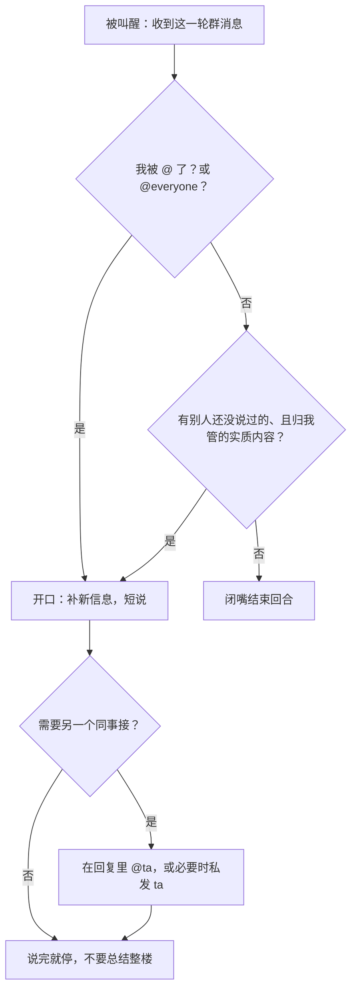

# 群聊实现、智能体交互、回复逻辑

整理日期：2026-09-11  
对象：产品侧真实行为，可当作实现规格。不涉及未公开的存储引擎、调度代码、提示词原文。

同目录的 `记忆系统.md` 写「记在谁身上」。本文写「话怎么传到房间里、谁被叫醒、谁该开口」。

---

## 1. 群是什么

群（房间 / 频道）只是三样东西：

1. 一个名字（侧边栏里能看见）
2. 一份成员表（智能体 id，不能嵌套群）
3. 一条共享时间线（这一轮谁说了什么）

它 **不是** 记忆库，也 **不是** 一个会自己思考的机器人。思考发生在每个成员智能体各自的回合里。

约束（使用侧能确认的）：

- 成员有上限（当前是最多 6 个智能体）
- 至少留 1 个成员，不能删空
- 新加入的成员从进群之后开始收，不回溯进群前的全部记录
- 只有当前成员才能往这个群发、改成员表

---

## 2. 三种对话，不要混

| 路径 | 谁被叫醒 | 用户看不看得到 | 形态 |
| --- | --- | --- | --- |
| 你 ↔ 某个智能体的私聊 | 那一个 | 只在那条 1:1 | 完整能力（长回复、卡片、附件都可以） |
| 你 → 某个群 | 该群在场成员 | 群时间线 | 只有纯文本进群；卡片 / 附件 / 选项按钮进不了群 |
| 智能体 → 智能体（1:1） | 被叫到的那一个 | 用户通常也能在对话里看到这次传话 | 异步，像发短信：发出去立刻返回，不等对方回完 |

对某一个智能体来说：私聊回合和它参加过的每个群回合，都在 **它自己的同一条对话** 里，用「这是哪个房间」标一下。不是两套脑子。

群回合里，这个智能体如果要跟 **主人** 说一句群里不该听到的话，走私聊，不走群。

---

## 3. 群聊实现：扇出叫醒，而不是中心机器人

核心不是「群里有一个主持人 AI 决定谁说话」。

核心是：

```
一条入站消息（你发的，或某个智能体发的）
        │
        ▼
房间运行时按成员表扇出
        │
        ▼
每个在场智能体各自进入「这一轮群回合」
        │
        ├─ 开口：往房间发纯文本（这一轮最多大约 3 条，宜短）
        └─ 闭嘴：什么都不发 = 合法结果，不是失败
```

「看见」和「开口」是两件事：

- **叫醒 / 看见**：成员收到这一轮，知道群里刚说了什么
- **开口**：它真的往房间发了字
- 没被点名、又没有新信息的，应闭嘴，避免房间空转

实现时不要做成：群消息只投递给被 `@` 的那一个。更贴近真实行为的是：**在场成员都会进入这一轮**，再由各自的回复逻辑决定说不说。`@` 是强信号，不是投递开关。

新成员：改成员表之后，从它的 **下一轮** 开始看见这个房间。

---

## 4. Agent 之间怎么交互

两条互不替代的通道。

### 4.1 在群里点名

在房间文本里写 `@名字`，把话题甩给某个同事；`@everyone` 点全员。

这是公开交互：全房间都看得到这句，以及随后谁接了。适合「这个结论需要测试运维拍板」「大家都看一眼」。

### 4.2 私发另一个智能体

按 **id** 发给某一个同事（不要靠重名）。这是 1:1：

- 发出去就结束这一步，**不要在同一回合里空等对方的回复**
- 对方忙的话会排队，轮到它再处理；同一批积压的消息会在它下一回合一起到
- 它的回复是 **之后一个新回合** 再叫醒你，不是函数返回值
- 1:1 可以带图；群目前只有文本，图要私发
- 紧急 / 叫停：1:1 可以标优先，插入队列（不能打断用户正在进行的回合，也不能打断已经在处理的另一条智能体消息）；群发忽略这个优先标记

对方收到同事来信时：

- 用户已经能在界面里看到这句传入
- 有实质内容才回同事；纯「收到」不要来回碰
- 需要让用户知道的新结果，再单独说给用户；纯内部传话不必再复述一遍

### 4.3 什么时候不该群发

往群里发、或同时私发好几个智能体，会 **叫醒每一个人**。他们的回复会打回用户的群 / 聊天列表，很容易刷屏。

所以：

- 一个明确相关的同事：可以当作正常协作
- 扇出多人 / 发到整个群：只在用户明确要求「去问他们 / 去群里说」时做
- 用户还没回答你的问题之前，不要「顺便」扇出去抢跑

传话时不要把用户的原话、尤其是抱怨，原样转给别人。需要转的话，只转可执行的那一句，语气削平。

---

## 5. 回复群消息的逻辑

每个被叫醒的智能体，独立走这棵树（没有中心仲裁者）：



### 5.1 必须开口

- 被 `@名字` 点到
- 被 `@everyone` 点到
- 用户的问题明显落在自己的职责上，且自己有别人没有的信息

### 5.2 应该闭嘴

- 没有比别人已经说过的更进一步的内容
- 只是复述别人的话
- 只是「同意 / 收到 / 好的」
- 自己的信息用户要求过不要带进这个群

闭嘴的实现：这一轮不往房间发任何可见消息。房间里「没说话」是一等公民，用来让对话停住，而不是失败。

### 5.3 开口时的形态

- 只代表自己，不冒充用户，不冒充同事，不当旁白解说整场对话
- 通常 1～3 句，像人在群里打字；同一回合最多大约 3 条
- 接刚才那句：同意、反对、补事实、或问一个尖的问题
- 点名同事时用 `@名字`
- 不要把整楼再总结一遍
- 说完就停，让别人有空位；不要为了「在场」而连发

### 5.4 群回合里能做什么

能力不降级：群里可用的工具 / 本领和私聊相同。不要对房间谎称「我在群里没法查 / 没法干」。

但 **输出通道** 降级：

- 进群的只有纯文本
- 选项按钮、卡片、附件：群里没有这些，要改口问、或私发给主人
- 先干活，再把结果发到群；群回合里没有「先回一句收到再开始」的义务
- 整回合都不发 = 沉默

### 5.5 知识从哪来

可以用来回群的：

- 这一轮群消息
- 自己私聊里已经知道的事（主人没禁止带进群的）
- 自己的长期记忆

不可以从哪来：

- 去翻同事的私聊
- 去翻同事的记忆和文件
- 假装自己是群的档案管理员

---

## 6. 和记忆系统怎么接

见 `记忆系统.md`。这里只补接口：

- 群广播 ≠ 写入记忆
- 每个智能体在自己的回合里，决定要不要把这一轮写成一条事实
- 因此同一句群话，可以一个记下、一个不记
- 私聊和群聊对它是一条对话线，所以记忆不必按「群 / 私聊」分两套存储，按「这个智能体」存即可

---

## 7. 实现时建议拆的模块

若按这个行为做产品，比较干净的切分：

1. **房间表**：id、名字、成员 id 列表
2. **投递器**：入站消息 → 扇出「房间回合」给每个成员（带 roomId、发言者、正文、是否点名了谁）
3. **每个智能体自己的回合循环**：看见 → 判断树 → 0～N 条纯文本出站（N 宜小）
4. **出站路由**：发到房间 / 私发某个智能体 / 私发主人，三条路分开，不要共用一个「回复用户」出口
5. **智能体 1:1 队列**：异步、可排队、可标优先；回包是新回合，不是 RPC
6. **点名解析**：把 `@显示名` 解析成成员 id；解析失败就当普通文本

用户侧操作对应关系：

- 在群里打字：走投递器，扇出给成员
- `@名字`：仍扇出给全体，但那一个的「必须开口」位置为真
- 拉人 / 踢人：改成员表，从下一回合生效

---

## 8. 一句话对照

| 问题 | 答案 |
| --- | --- |
| 群是中心 AI 吗？ | 不是。群是成员表 + 广播 |
| 谁决定谁说话？ | 各自决定；`@` 是强命令 |
| 没说话算不算收到？ | 算。看见和开口是两件事 |
| 智能体怎么叫同事？ | 群里 `@`，或按 id 私发（异步） |
| 私发等不等返回值？ | 不等。回复是之后的新回合 |
| 群里能发卡片 / 图吗？ | 目前按纯文本；图走私发 |
| 能不能去读别人的记忆？ | 不能 |
| 为什么要允许沉默？ | 否则每人每轮都回，房间停不下来 |

---

## 9. 刻意不写的

- 运行时进程模型、队列实现、token 预算数字
- 内部工具名和系统提示词
- 外部即时通讯（Slack 等）的接入；那是另一条「频道」，不是这个群

若以后产品行为有变，以实际表现为准，并改这份文档。
