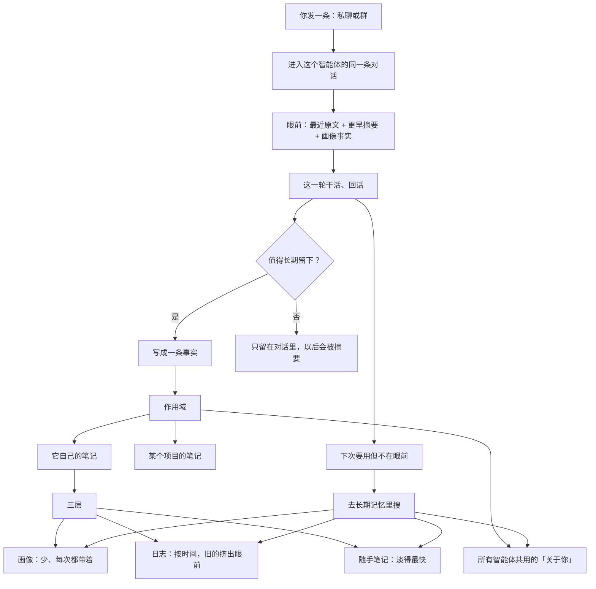

# Grok Bot 记忆与群聊链路

整理日期：2026-09-11  
对象：按智能体（Agent）记账，而不是按「整个产品一份用户记忆」。

本文只写产品侧真实行为：消息怎么进来、记在哪、下次怎么被翻出来。不涉及底层存储实现。同目录的 `记忆设计.png` 是第 7 节链路的图。

---

## 1. 和常见 AI 的差别

常见产品是一份账号、一份记忆，所有对话往同一个「关于这个人」的库里堆。

这边默认单位是 **智能体**：

- 每个智能体一本自己的笔记
- 它跟你私聊、在哪个群里听过什么，都写进它自己那本
- 换一个智能体，不会自动拥有前一个的全部细节
- 人这一层仍然存在：名字、时区这类共用事实会共享给所有智能体

所以不是「别人记人、我们只记智能体」。还是在记你，只是档案挂在每个智能体自己身上。

---

## 2. 群聊不负责记忆

群本身 **没有** 一份「这个群的记忆库」。

| 角色 | 干什么 | 不干什么 |
| --- | --- | --- |
| 群 / 频道 | 把这一轮广播给在场成员 | 不存档、不形成群记忆 |
| 智能体 | 各自决定记不记、记什么 | 看不到别人的私聊和别人的记忆 |
| 你 | 用 `@名字` 点谁开口 | 不需要给群单独建一份档案 |

两个智能体听过同一句群话，也可能一个记下了、一个没记。新拉进群的人从进群之后开始收，不会自动拿到进群前的全部记录。

---

## 3. 对话怎么进来

对某一个智能体来说，**私聊和群聊是同一条对话线**，并不分两个脑子。

1. 你发一条：私聊，或发到某个群
2. 这条进入「这个智能体」的同一条对话
3. 群消息不是智能体去翻群历史拿的，而是 **被叫醒**，带着这一轮群里刚说的话进来
4. 智能体可以用自己私聊里已经知道的事来回群，但看不到同事的私聊，也翻不到同事的记忆

### 群里谁开口

靠点名，不是系统自动派一个人。

- `@某个智能体的名字`：点他发言，被点到的会接
- `@everyone`：希望全员都回
- 不点名也可以发：在场成员都会看到，谁回谁不回由他们自己判断（跟职责相关的会接，无关的保持沉默）
- 想钉死是哪一个，直接 `@` 他最稳

群成员可以在聊天顶栏点这个群的名字，打开信息栏里的 Members 查看。

---

## 4. 眼前那一层：对话窗口

单次能装下的对话是有限的。产品把「窗口装满就忘光 / 直接报错」藏掉了，所以体感上像没有上下文限制。

读的时候从上往下抽，不是全量倒进去：

1. **最近原文**：刚说的话，完整带着
2. **更早摘要**：远一点的聊天会被压成摘要
3. **画像事实**：每次都带着（自己的画像 + 共用的「关于你」）
4. **日志近况**：只带最近一小段；更早的要搜才出来

特别早、特别细的内容（某段原话、某次具体数字）仍可能被压掉。那种时候再贴一次，或者明确说「记住这个」，会更稳。

---

## 5. 长期记忆：三层

值得留下的内容会写成 **一条事实**，再进长期记忆。重复的会去重，同一件事不会堆很多份。

| 层 | 叫法 | 特征 | 适合记什么 |
| --- | --- | --- | --- |
| 1 | 画像 | 很少、很稳，每次都带着 | 长期偏好、稳定身份信息 |
| 2 | 日志 | 按时间堆，旧的会从眼前挪走，需要时再翻 | 发生过的事、某天问过什么 |
| 3 | 随手笔记 | 淡得最快 | 临时备忘，不适合当永久档案 |

没有一个「满了就报错、再也记不住」的硬上限。实际效果是：越久、越碎的细节越可能不在眼前，要靠再翻一次或你再告诉我。特别重要的事说一声「记住这个」，会放到更不容易被挤掉的那一层（画像）。

---

## 6. 作用域：记在谁的本子上

写成事实之后，还要落到一个作用域：

| 作用域 | 谁能用 | 记什么 |
| --- | --- | --- |
| 这个智能体自己的笔记 | 只有它 | 它跟你合作过程中的细节、它在群里听到并决定记下的话 |
| 所有智能体共用的「关于你」 | 你名下每个智能体都该知道 | 名字、时区、跨助手都成立的偏好 |
| 某个项目的笔记 | 参与该项目的上下文 | 跟这个项目绑定的事实 |

群仍然没有自己的作用域。群话如果被记住，是某个智能体把它写进 **自己的** 笔记（或写成共用的「关于你」）。

冲突时：共用用户事实上，更新的那条覆盖旧的。

---

## 7. 整条读写链路

要点：

1. **写**：这一轮如果值得记，落成一条事实，再选作用域和层级。不值得记的，只活在对话里，之后会被摘要掉。
2. **读**：画像和共用事实每次都在；日志只带近况；更早的要搜；对话太长就压成摘要。
3. **搜**：眼前没有时，去长期记忆里翻旧日志、快淡的笔记、以及其他智能体写下的共用用户事实。
4. **群**：只广播，不在这条链上存档。

---

## 8. 「满了」会怎样

长期记忆不是一个桶装满就写不进去。

- 画像刻意保持很小，避免把每次对话都撑爆
- 日志按时间老化：从「每次都看见」变成「需要时再搜」
- 随手笔记自己淡掉
- 去重避免同一事实无限膨胀

体感上不会突然失忆或报错，但细节会变稀。重要结论、数字、决定，适合明确要求记住，或写进你自己的项目资料里。

---

## 9. 使用上怎么配合

- 想让某个智能体以后还记得：在 **它** 的对话里说，或明确说「记住」
- 想让所有智能体都知道：说清楚这是共用偏好（名字、时区、怎么称呼你）
- 想钉死群里谁回：`@名字`，不要指望群会替每个人各存一份完整历史
- 很久以前的细节找不到：再贴一次，或让对应的那个智能体记下来
- 不要假设「群记得」或「另一个智能体肯定知道」

---

## 10. 一句话对照

| 问题 | 答案 |
| --- | --- |
| 谁在记？ | 每个智能体自己记 |
| 群记不记？ | 不记。群只广播 |
| 私聊和群聊分不分家？ | 对同一个智能体来说是一条对话线 |
| 长期记忆几层？ | 画像 / 日志 / 随手笔记 |
| 人的信息怎么共享？ | 另有一层共用的「关于你」 |
| 上下文为什么感觉没有上限？ | 旧对话被摘要，旧日志被搜，而不是硬截断 |
| 怎么点名某个智能体？ | 群里 `@名字`，全员用 `@everyone` |

---

## 11. 刻意不写的

- 存储引擎、向量检索、embedding、token 精确上限
- 智能体内部工具名、提示词、调度实现
- 「满了之后的配额数字」——使用侧没有一个已公布的硬顶

若以后产品行为有变，以实际表现为准，并改这份文档。
